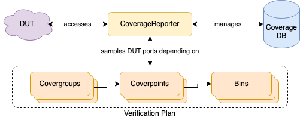

# ChiselVerify: A Hardware Verification Library for Chisel

In this repository, we proprose ChiselVerify, which is the beginning of a verification library within Scala for digital hardware described in [Chisel](https://github.com/chipsalliance/chisel3), but also supporting legacy components in VHDL, Verilog, or SystemVerilog. The library runs off of [ChiselTest](https://github.com/ucb-bar/chisel-testers2) for all of the DUT interfacing. An early technical report describing the initial version of the library in detail is available online: [Open-Source Verification with Chisel and Scala](https://arxiv.org/abs/2102.13460). For the most up-to-date writing on topic, please refer to [Verification of Chisel Hardware Designs with ChiselVerify](https://www.sciencedirect.com/science/article/pii/S0141933122002666).  

When you use this library in a research project, please cite it as:
```
@article{dobis2023verification,
  title = {Verification of Chisel Hardware Designs with ChiselVerify},
  author = {Dobis, Amelia and Laeufer, Kevin and Damsgaard, Hans Jakob and Petersen, Tjark and Rasmussen, Kasper Juul Hesse and Tolotto, Enrico and Andersen, Simon Thye and Lin, Richard and Schoeberl, Martin},
  journal = {Microprocessors and Microsystems},
  volume = {96},
  pages={104737},
  year={2023},
  publisher={Elsevier}
  issn = {0141-9331},
  doi = {https://doi.org/10.1016/j.micpro.2022.104737},
  url = {https://www.sciencedirect.com/science/article/pii/S0141933122002666}
}
```

ChiselVerify is published on Maven. To use it, add following line to your
```build.sbt```:

```
libraryDependencies += "io.github.chiselverify" % "chiselverify" % "0.4.0"
```

Run tests with
```
make
```

This README contains a brief overview of the library and its functionalities. For a more in-depth tutorial, please check-out the [ChiselVerify Wiki](https://github.com/chiselverify/chiselverify/wiki). Other general documentation, such as technical reports, journal, and conference papers related to the chiselverify project can be found in the [documentation repository](https://github.com/chiselverify/documentation).
  
**********************************

# Verification Library for Chisel
The library can be divided into 4 main parts:
1. __Functional Coverage__: Enabling Functional Coverage features like Cover Points, Cross Coverage, Timed Coverage and Conditional Coverage.
2. __Constrained Random Verification__: Allowing for constraints and random variables to be defined and used directly in Scala.
3. __Bus Functional Models__: Enabling Transactional modeling for standardized Buses like _AXI4_.
4. __Approximate Design Verification__: Provides comparative port samplers, as well as several error metrics that simplify the verification of approximate deisgns.    
  
> __THE API PRESENTED IN THIS README MIGHT BE OUT-DATED, AS IT IS ONLY UPDATED OCCASIONALLY. THE MAIN SOURCE OF INFORMATION THAT SHOULD BE USED TO LEARN HOW TO USE THE LIBRARY IS [THE WIKI](https://github.com/chiselverify/chiselverify/wiki).__

## Functional Coverage in Chisel
The idea is to implement functional coverage features directly in Chisel. The structure of the system can be seen in the diagram below.



#### Coverage Reporter
This is the heart of the system. It handles everything from registering the Cover Points to managing the Coverage DataBase. It will also generate the final coverage report. Registering _Cover Points_ together will group them into a same _Cover Group_.

#### Coverage DataBase
This DataBase handles the maintenance of the values that were sampled for each of the Cover Point bins. This allows us to know how much of the verification plan was tested. The DataBase also keeps mappings linking _Cover Groups_ to their contained _Cover Points_.

### How to use it
The Functional coverage system is compatible with the ChiselTest framework.
1. The `CoverageReporter` must first be instanciated within a test.
2. `CoverGroup`s can then be created by using the `register` method of the coverage reporter. This takes as parameter a `List[Cover]`. `Cover` represents either a `CoverPoint` or a `CoverCondition` that contains a `port` that will be sampled, a `portName` that will be shown in the report and either a `List[Bins]`, created from a name and a scala range, or a `List[Condition]`, created from a name and an arbitrary condition function.
3. `CoverGroups` may also contain a `List[Cross]` which represents a set of hit relations between two ports.
4. The port must then be manually sampled by calling the `sample` method of the coverage reporter.
5. Once the test is done, a coverage report can be generated by calling the `printReport` or `report` methods of the coverage reporter.

An example of this can be found [here](./src/test/scala/examples/leros/AluAccuTester.scala).

### Timed Cross Coverage
__Idea__: We want to check the relationship between two ports with a delay of a certain amount of cycles.
__Example__: We have the following situation, imagine we have a device that breaks if:
- `dut.io.a` takes the value of `1.U` at cycle 1
- `dut.io.b` takes the value of `1.U` the following cycle

We want to verify that the above case was tested. This can be done by defining a `TimedCross` between the two points:
```scala
val cr = new CoverageReporter(dut)
cr.register(
  // Declare CoverPoints
  cover("a", dut.io.a)(DefaultBin(dut.io.a)),
  cover("b", dut.io.b)(DefaultBin(dut.io.b)),
  // Declare timed cross point with a delay of 1 cycle
  cover("timedAB", dut.io.a, dut.io.b)(Exactly(1))(
    cross("both1", Seq(1 to 1, 1 to 1))
  )
)
```

Using that, we can check that we tested the above case in our test suite. This construct can be used to check delay between two cover points.

#### Use
To be able to use the timed coverage, stepping the clock must be done through the coverage reporter:
```scala
dut.clock.step(nCycles) // Will trigger an exception if used with Timed Cross Coverage
cr.step(nCycles)        // This works and updates the DataBase
```
This is done in order ensure that the coverage DataBase will always remain synchronized with the DUT's internal clock.

#### Delay Types
The current implementation allows for the following special types of timing:
- `Eventually`: This sees if a cross hit was detected at any point in the next given amount of cycles.
- `Always`: This only considers a hit if the it was detected every cycle in the next given amount of cycles.
- `Exactly`: This only considers a hit if it was detected exactly after a given amount of cycles.

### Timed Assertions  
Delay types can also be used in order to used `Timed Assertions` or `Timed Expect`. These can be used in order to check an assertion, in the form of an arbitrary function, with an added timing argument. We could thus check, for example, that two ports are equal two cycles appart. For example:
```scala
AssertTimed(dut, dut.io.a.peek() === dut.io.b.peek(), "aEqb expected timing is wrong")(Exactly(2)).join()
```
This can also be done more naturally with the `Expect` interface:
```scala
ExpectTimed(dut,dut.io.a, dut.io.b.peek().litValue(), "aEqb expected timing is wrong")(Exactly(2)).join()
```
These can also be used with a simplyfied syntax, inspired by ScalaTest syntax:
```scala
// For Timed Assertions
eventually(2, "aEqb expected timing is wrong") { dut.io.a.peek() === dut.io.b.peek() }
exact(2, "aEqb expected timing is wrong") { dut.io.a.peek() === dut.io.b.peek() }
always(2, "aEqb expected timing is wrong") { dut.io.a.peek() === dut.io.b.peek() }
never(2, "aEqb expected timing is wrong") { dut.io.a.peek() === dut.io.b.peek() }
```

### Example use case
Here is a toy example of how to use the assertion:
```scala
always(9, "a isn't always less than or equal to one") { LtEq(dut.io.outB, dut.io.outA) }
always(9, "a isn't always greater than or equal to one") { GtEq(dut.io.outB, dut.io.outA) }
```

### Cover Conditions
__Idea__: A type of coverpoint that can apply arbitrary hit conditions to an arbitrary number of ports.
```scala
cover(readableName: String, ports: Data*)(conditions: Condition*)
// where a condition is declared using the bin function without a range
bin(name: String, func : Seq[BigInt] => Boolean)
```
__Example__:
```scala
val cr = new CoverageReporter(dut)
cr.register(
  // Declare CoverPoints
  cover("aAndB", dut.io.outA, dut.io.outB)(
    bin("aeqb", { case Seq(a, b) => a == b })
  )
)
```

Bins are thus defined using arbitrary functions of the type `List[BigInt] => Boolean` which represent different hit conditions. No coverage percentage is given due to cartesian product complexity. Instead, we offer the possibility to use a user-defined "expected number of hits" to get a coverage percentage. This looks like the following:
```scala
val cr = new CoverageReporter(dut)
cr.register(
  // Declare CoverPoints
  cover("aAndB", dut.io.outA, dut.io.outB)(
    bin("asuptobAtLeast100Times", condition = { case Seq(a, b) => a > b }, expectedHits = 100)
  )
)
```
The above example results in the following coverage report:
```
============ COVERAGE REPORT ============
============== GROUP ID: 1 ==============
COVER_CONDITION NAME: aAndB
CONDITION aeqb HAS 4 HITS
CONDITION asuptobAtLeast100 HAS 95 HITS EXPECTED 100 = 95.0%
=========================================
=========================================
```

## Constrained Random Verification (CRV)
The CRV package inside this project aims to mimic the functionality of SystemVerilog constraint programming and integrates them into [ChiselTest](https://github.com/ucb-bar/chisel-testers2). It combines a Constraint Satisfactory Problem (CSP) solver with some helper classes to create and use random objects inside your tests. Currently, only the [jacop](https://github.com/radsz/jacop) backend is supported, but in the future other backends can be added.

### Comparison
The following is a comparison of how to describe a randomizable packet with SystemVerilog and our proposed framework.

#### SystemVerilog
```systemverilog
class frame_t;
rand pkt_type ptype;
rand integer len;
randc bit [1:0] no_repeat;
// Constrain the members
constraint legal {
  len >= 2;
  len <= 5;
}
```

#### CRV w/ jacop backend
```scala
class Frame extends RandObj(new Model) {
  val pkType: RandVar = rand(0, 3)
  val len: RandVar = rand(0, 10)
  val noRepeat: RandVar = rand(0, 1, Cyclic)

  val legal = new ConstraintGroup {
    len >= 2
    len <= 5
  }
}
```

### Random Objects
Random objects can be created by extending the RandObj trait. This class accepts one parameter which is a Model. A model correspond to a database in which all the random variables and constraints declared inside the RandObj are stored.
```scala
class Frame extends RandObj(new Model)
```
A model can be initialized with a seed `new Model(42)`, which allows the user to create reproducible tests.

#### Random Fields  
Random fields are defined using the following function: 
```scala
def rand(min: Int, max: Int, randType: RandType = Normal)(implicit model: Model)
```  

A random field can be added to a `RandObj` by declaring a Rand variable.
```scala
  val len = rand(0, 10)
```

Random-cyclic variable can be added by declaring a `Randc` field inside a `RandObj`. This is done using the `Cyclic RandType` parameter.
```scala
  val noRepeat = rand(0, 1, Cyclic)
```

#### Constraints
Each variable can have one or multiple constraints. These are defined using constraint operators.
```scala
len >= 2
```
In the previous block of code we are specifying that the variable `len` can only take values that are grater then 2. Each constraint can be assigned to a variable and enabled or disabled at any time during the test.
```scala
val lenConstraint = len > 2
[....]
lenConstraint.disable()
[....]
lenConstraint.enable()
```

Constraints can also be grouped together in a `ConstraintGroup` and the group itself can be enabled or disabled.

```scala
val legal = new ConstraintGroup {
  len >= 2
  len <= 5
  payload.size == len
}
[...]
legal.disable()
[...]
legal.enable()
```

By default, constraints and constraint groups are enabled when they are declared.

The list of operator used to construct constraints is the following: `<`, `<=`, `>`, `>=`,`==`, `div`, `*`, `mod`, `+`, `-`, `\=`, `^`, `in`, `inside`.

It is also possible to declare conditional constraints with constructors like `IfCon` and `IfElseCon`.
```scala
val constraint1 = IfCon(len == 1) {
    payload.size == 3
  } ElseC {
    payload.size == 10
  }
```

### Usage
As in SystemVerilog, each random class exposes a method called `randomize()` to solve the constraint problem specified in the class and assign to each random field a random value. The method returns `true` only if the CSP found a set of values that satisfy the current constraints.
```scala
val myPacket = new Frame(new Model)
assert(myPacket.randomize)
```

Other usage examples can be found in our [backend tests](./src/test/scala/verifyTests/crv/backends/jacop/TestRandJacop.scala).

## Verification of Approximate Designs
The `approximation` package within this library serves to simplify the process of verifying that approximate hardware designs satisfy commonly applied error metrics relative to exact counterparts.

#### Metric
Error metrics contained within the library follow a hierarchy of two different characteristics that describe the values they return and which kind of inputs they take. Specifically, `Instantaneous` metrics may be computed on a single sample from two ports, whereas `HistoryBased` metrics require sequences of samples. `Absolute` metrics return non-normalized results, while `Relative` metrics return normalized or somehow relativized results. Inheriting (case) classes must extend one of `Instantaneous` or `HistoryBased` and mixin either `Absolute` or `Relative`.

#### Watcher
These elements implement distributed sampling and storage for keeping track of a pair of an approximate port and its related exact port (or an exact reference value) and any number of metrics to track for them. While the main class is abstract and not meant to be used, these elements come in two types:
- `Tracker`s that can simply sample port values and report on given metrics but lack verification features, thus ignoring any maximum values for the metrics provided.
- `Constraint`s that extend upon the functionality of the `Tracker` by also allowing for verification, requiring that all provided metrics have maximum values.

In practice, these two are created using the simple API end-points `track` and `constrain`. They come in two variants: reference-based and port-based. The former are to be used with software models and require passing in expected values when sampled. Contrarily, the latter are to be used with combined DUTs that provide both approximate and exact outputs, thus not requiring but nonetheless accepting reference values when sampled.

#### Error Reporter
This is the core of the system. It handles any number of `Tracker`s and/or `Constraints`, sampling of their related ports, reporting on their results, and verifying that their constraints are met.

### How to use it
The approximate verification system is closely modeled after our functional coverage tools and remains fully compatible with the ChiselTest framework. Tests may be written in one of two ways depending on whether the exact DUT is implemented as a Chisel `Module` or as a software model.

1. As ChiselTest only allows for testing one Chisel module at a time, it is necessary to first define a top-level module that contains both the approximate and exact DUTs, should the exact DUT be implemented as a Chisel `Module`. Otherwise, skip ahead to step 2.
2. The `ErrorReporter` must then be instantiated within a test and provided any number of `Tracker`s and/or `Constraints` watching ports of the DUT.
3. When instantiated, its watchers must be sampled manually by calling the `sample` method of the error reporter. If the exact DUT is a software model, this method must be passed a map of port to reference value pairs with the ports corresponding to ones registered in the watchers. It is not possible to sample a reference-based watcher without passing it a reference value. It is valid to use a combination of reference-based and port-based watchers and selectively override port-based watchers' exact values by passing in expected values.
4. Once the test is done, an error report can be generated by calling the `report` methods of the error reporter and printing its return value.

An example of this can be found [here](./src/test/scala/examples/ApproxAdderTest.scala).

## Example Use Cases

We will explore a handful of use cases to explore verification.

* Leros ALU (basically done)
* Heap priority queue (from MicroSemi),
  see also https://www.hackerearth.com/practice/notes/heaps-and-priority-queues/
* Network-on-chip (in Chisel), see https://github.com/schoeberl/soc-comm
* Decimation filter from WSA (VHDL code plus testbench given)
* Approximate adder (Chisel code plus testbench given)

*******************************

### Universal Verification Method (UVM) Examples
In the early stages of this project, we explored the possibilty of using UVM to verify Chisel designs. Thus, the [sv](https://github.com/chiselverify/otherverify/tree/main/sv) directory in another repository of ours contains a number of UVM examples.

#### Simple examples
In `sv/uvm-simple-examples` a number of simple examples are located. These start with a very basic testbench with no DUT attached, and gradually transition into a complete testbench.

#### Vivado UVM Examples
These examples assume that a copy of Xilinx Vivado is installed and present in the PATH. The examples are currently tested only on Linux. The first example is taken from [Vivado Design Suite Tutorial - Logic Simulation](https://www.xilinx.com/support/documentation/sw_manuals/xilinx2020_1/ug937-vivado-design-suite-simulation-tutorial.pdf).

#### Leros ALU
In the directory [sv/leros](https://github.com/chiselverify/otherverify/tree/main/sv/leros), the [Leros ALU](./src/main/scala/leros/AluAccuChisel.scala) is tested using UVM, to showcase that Chisel and UVM can work together. This testbench is reused to also test a VHDL implementation of the ALU, to show that UVM is usable on mixed-language designs (when using a mixed-language simulator).

The VHDL implementaion is run by setting the makefile argument `TOP=top_vhd`.

#### Using the SystemVerilog Direct Programming Interface (DPI) and Java's Native Interface (JNI)
Using the SystemVerilog DPI to cosimulate with a golden model described in C is explored in the [sv/leros/scoreboards/scoreboard_dpi.svh](https://github.com/chiselverify/otherverify/tree/main/sv/leros/scoreboards/scoreboard_dpi.svh). The C-model is implemented in [sv/leros/scoreboards/scoreboard.c](https://github.com/chiselverify/otherverify/tree/main/sv/leros/scoreboards/scoreboard.c), and the checking functionality is called from the SystemVerilog code.

Implementing a similar functionality in Scala/Chisel has been explored via the JNI. In the directory [native](https://github.com/chiselverify/otherverify/tree/main/native), the necessary code for a simple Leros tester using the JNI is implemented.

To use the JNI functionality, first run `make jni` to generate the correct header files and shared libraries. Then, open sbt and type `project native` to access the native project. Then run `sbt test` to test the Leros ALU using a C model called from within Scala. To switch back, type `project chisel-uvm`.

************************************

# Resources
If you're interested in learning more about the UVM, we recommend that you explore the [otherverify](https://github.com/chiselverify/otherverify) repository as well as some of the following links:
* [First steps with UVM](https://www.youtube.com/watch?v=qLr8ayWM_Ww)
* [UVM Cookbook (requires an account)](https://verificationacademy.com/cookbook/uvm)
* [ChipVerify.com UVM Tutorials](https://www.chipverify.com/table/uvm/)
* [Ray Salemi's UVM Primer videos](https://www.youtube.com/watch?v=eeU2zpgXv1A&list=PLigQ6Cc3qFpI_WTgqtDXi_Msk3yRuKGGJ)  

************************************

# Related Work

## Fuzzing 
Here are a few pointers to some interesting documentation around the topic of mutation-based fuzzing:  
* [American Fuzzy Lop (AFL)](https://github.com/google/AFL)  
* [Binary fuzzing strategies: what works, what doesn't](https://lcamtuf.blogspot.com/2014/08/binary-fuzzing-strategies-what-works.html)  
* [AFL "Whitepaper"](https://lcamtuf.coredump.cx/afl/technical_details.txt)  
* [A bit more about american fuzzy lop](https://lcamtuf.blogspot.com/2014/08/a-bit-more-about-american-fuzzy-lop.html)  
* [The fuzzing book - Mutation-Based Fuzzing](https://www.fuzzingbook.org/html/MutationFuzzer.html)  
* [RFuzz conference paper](https://people.eecs.berkeley.edu/~ksen/papers/rfuzz.pdf)  
* [RFuzz](https://github.com/ekiwi/rfuzz)

## CRV
* [Choco-Solver](https://github.com/chocoteam/choco-solver) Java library for solving CSP problems
* [QuickCheck](https://hackage.haskell.org/package/QuickCheck) Checker for Haskel, used Lava as example, the inspiration for ScalaCheck

## Testing Frameworks / Simulation Tools
### Cocotb -- coroutine-based cosimulation library for hardware development in Python
[Cocotb repository](https://github.com/cocotb/cocotb): cocotb is a coroutine based cosimulation library for writing VHDL and Verilog testbenches in Python.

#### Resources Related to Cocotb
* Philipp Wagner (FOSSi Foundation, lowRISC) ["Cocotb: Python-powered hardware verification"](https://www.youtube.com/watch?v=GUcKJ5zXgPA) (WOSH 2019) (video)
* Ben Rosser (University of Pennsylvania) ["Cocotb: a Python-based digital logic verification framework"](https://indico.cern.ch/event/776422/attachments/1769690/2874927/cocotb_talk.pdf) (CERN 2018) (pdf)
* Torbjørn Viem Ness (NTNU) ["Low Power Floating-Point Unit for RISC-V"](https://brage.bibsys.no/xmlui/bitstream/handle/11250/2564801/19493_FULLTEXT.pdf?sequence=1&isAllowed=y) (2018) [PDF]
* Andrey Filippov (Elphel) ["I will not have to learn SystemVerilog"](https://www.elphel.com/blog/2016/07/i-will-not-have-to-learn-systemverilog/) (2016) [Blog]
* Chris Higgs (Potential Ventures) "Applying agile techniques to FPGA development" [Video](https://www.youtube.com/watch?v=Wi_1bUgHl8s), [Paper](http://www.testandverification.com/conferences/verification-futures/2015-europe/speaker-chris-higgs-potential-ventures/)
* Chris Higgs (Potential Ventures) ["Rapid FPGA Verification"](https://docs.google.com/presentation/d/1U22Y_yyQRAecXXvOKFbHU8p_pGsB-u7iaK57Tw92U_A/embed?start=false&loop=false&delayms=3000) (NMI, February 2014) [Slides]
* Smith, Andrew Michael; Mayo, Jackson; Armstrong, Robert C.; Schiek, Richard; Sholander, Peter E.; Mei, Ting (Sandia National Lab): ["Digital/Analog Cosimulation using CocoTB and Xyce"](https://www.osti.gov/biblio/1488489) (paper)

#### Extension of Cocotb
* [cocotb-coverage](https://github.com/mciepluc/cocotb-coverage): Extension that enables coverage and constrained random verification
* Publication in IEEE [Paper](https://ieeexplore.ieee.org/document/7566600)
* [python-uvm](https://github.com/tpoikela/uvm-python): port of SystemVerilog (SV) Universal Verification Methodology (UVM) 1.2 to Python and cocotb

### Hwt --  Python library for hardware development
[hwt](https://github.com/Nic30/hwt):  one of the goals of this library is to implement some simulation features similar to UVM

## Not strictly relevant resources
* [CRAVE: An advanced constrained random verification environment for SystemC](https://ieeexplore.ieee.org/document/6376356)
* [EnrichingUVM in SystemC with AMS extensions for randomization and functional coverage](https://www.researchgate.net/publication/267437715_Enriching_UVM_in_SystemC_with_AMS_extensions_for_randomization_and_coverage)
* [Coverage  directed  test  generation  for  functional  verification  using  Bayesian  network](https://www.research.ibm.com/haifa/dept/_svt/papers/simulation/18_2.pdf)
* [Introducing XCS to Coverage Directed test Generation](https://ieeexplore.ieee.org/document/6114166)
* [LiveHD](https://github.com/masc-ucsc/livehd) LiveHD is an infrastructure designed for Live Hardware Development. By live, we mean that small changes in the design should have the synthesis and simulation results in a few seconds, as the fast interactive systems usually response in sub-second.
